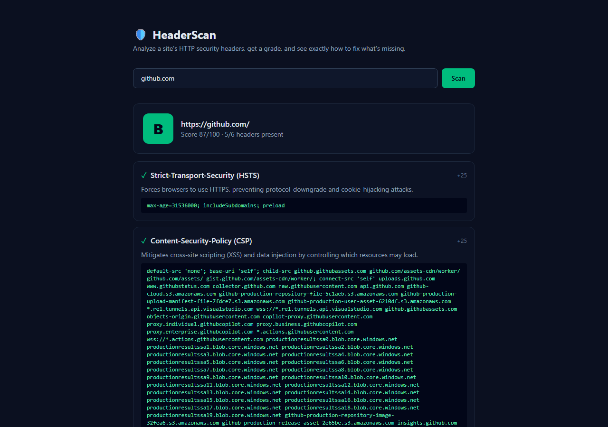

<!-- ══════════════════════════ TITLE ══════════════════════════ -->
<div align="center">
  
</div>

<!-- ══════════════════════ IDIOMAS / LANGUAGES ══════════════════════ -->
<div align="center">
<a href="README.md"></a>
<a href="README.en.md"></a>
<a href="README.es.md"></a>
</div>

<div align="center">


</div>

<div align="center">
<a href="#about"></a>
<a href="#what-it-checks"></a>
<a href="#how-it-works"></a>
<a href="#usage"></a>
</div>

<br/>

> 🛡️ **Defensive tool.** It only reads the publicly returned response headers of a URL you submit — no port probing, no payloads sent.

<div align="center">
  
</div>

## About

**HeaderScan** analyzes a website's **HTTP security headers**, assigns a grade (A–F), and shows exactly how to fix what's missing. The scan runs in a Node.js **route handler** (server-side fetch), so there are no CORS limitations.

## What it checks

| Header | Why it matters |
|---|---|
| Strict-Transport-Security (HSTS) | Forces HTTPS; blocks downgrade attacks |
| Content-Security-Policy (CSP) | Mitigates XSS and injection |
| X-Content-Type-Options | Stops MIME sniffing |
| X-Frame-Options | Prevents clickjacking |
| Referrer-Policy | Limits referrer leakage |
| Permissions-Policy | Restricts powerful browser features |

Each present header contributes to a weighted score; the grade is derived from the total. Missing headers come with a copy-ready recommended value.

## How it works

`POST /api/scan` with `{ "url": "example.com" }`:

1. Normalizes the URL (adds `https://` if needed, validates the scheme).
2. Fetches it server-side with a 10s timeout, following redirects.
3. Inspects the response headers and returns a graded report.

## Usage

```bash
npm install
npm run dev      # http://localhost:3000
```

## License

[MIT](LICENSE).

<div align="center">
  
</div>

<p align="center"><sub>Built by <strong><a href="https://github.com/geoggrigori">Grigori</a></strong> · 2026</sub></p>
